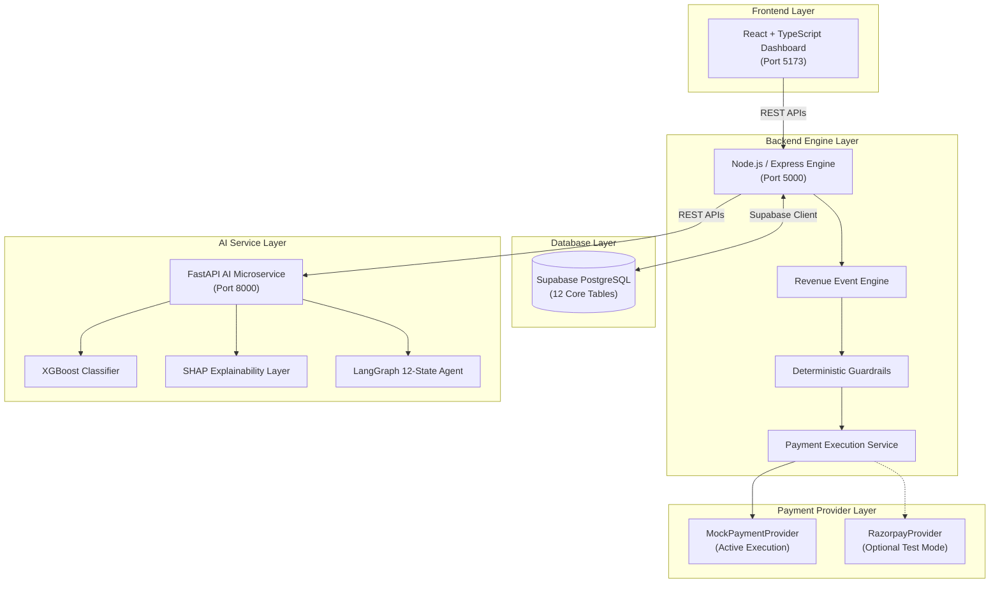

# RazorRecover — AI Revenue Recovery Agent

> **AI-powered closed-loop revenue recovery agent for failed subscription payments.**

---

## 1. Problem

Revenue leakage is one of the largest hidden drains on subscription businesses. It occurs when recurring payments fail due to soft declines, bank timeouts, expired cards, or overdue invoices. 

Simply detecting payment failures is not enough. Passive notifications and blind retry loops result in customer churn and lost revenue. Businesses need a system that can:
- **Diagnose** the exact root cause of failure.
- **Select** an appropriate, customer-aware intervention.
- **Execute** recovery actions safely within hard policy boundaries.
- **Measure** actual recovered revenue.

---

## 2. Solution

**RazorRecover** is an AI-powered revenue recovery agent that executes an 8-step closed-loop workflow:

$$\text{Detect} \longrightarrow \text{Diagnose} \longrightarrow \text{Predict} \longrightarrow \text{Decide} \longrightarrow \text{Guard} \longrightarrow \text{Execute} \longrightarrow \text{Verify} \longrightarrow \text{Measure}$$

1. **Detect**: Ingests payment failure events in real time.
2. **Diagnose**: Analyzes payment gateway error codes, payment methods, and customer history.
3. **Predict**: Uses an XGBoost classifier to compute recovery probability ($P_{recovery} \in [0.0, 1.0]$).
4. **Decide**: Uses a stateful 12-state LangGraph agent (+ Gemini LLM) to select optimal interventions.
5. **Guard**: Enforces deterministic safety rules (max retries, high-value limits, opt-outs).
6. **Execute**: Simulates or executes payment retries via `MockPaymentProvider`.
7. **Verify**: Confirms settlement status dynamically.
8. **Measure**: Tracks actual recovered revenue, risk metrics, and audit trails in a live dashboard.

---

## 3. Key Differentiators

> *"RazorRecover is a closed-loop revenue recovery system rather than a simple prediction model or dashboard."*

- **Autonomous Closed Loop**: Unifies detection, ML prediction, SHAP explainability, LLM diagnosis, guardrail validation, execution, and audit logging into a single automated pipeline.
- **Explainable AI (SHAP)**: Provides feature-level attribution and human-readable narratives for every prediction.
- **Deterministic Guardrails**: Hard policy boundaries prevent unauthorized execution regardless of LLM recommendations.
- **Zero Credentials Needed**: `MockPaymentProvider` enables reliable, repeatable demo runs without requiring live payment gateway credentials.

---

## 4. Architecture



### Component Breakdown

| Layer | Technology | Primary Responsibility |
| :--- | :--- | :--- |
| **Frontend** | React, TypeScript, Vite, Tailwind, Recharts | Interactive fintech dashboard, live KPI metrics, case details, SHAP charts, audit explorer. |
| **Backend** | Node.js, Express | Event engine, rate limiting, input validation, payment service, guardrails, audit logging. |
| **Database** | Supabase PostgreSQL | Relational data store for events, cases, predictions, attempts, audit logs, and customer profiles. |
| **AI Service** | FastAPI, Python 3.10+ | Microservice hosting XGBoost prediction, SHAP explainability, and LangGraph workflow agent. |
| **ML Model** | XGBoost, scikit-learn, joblib | Binary classifier evaluating 13 features to compute recovery probability ($P_{recovery}$). |
| **Explainability** | `shap` (TreeExplainer) | Calculates local feature contributions and generates human-readable explanations. |
| **Agent** | LangGraph, Gemini LLM | 12-state stateful workflow graph orchestrating diagnosis and intervention selection. |
| **Providers** | `MockPaymentProvider` | Active execution provider delivering deterministic simulated settlement with zero credentials. |

---

## 5. Project Structure

```
RazorRecover/
├── ai-service/          # FastAPI service (XGBoost, SHAP, LangGraph agent)
│   ├── data/            # Synthetic billing dataset generation scripts
│   ├── models/          # Trained model artifacts (recovery_model.joblib, model_metadata.json)
│   └── agent.py         # 12-state LangGraph recovery workflow graph
├── backend/             # Express API (Revenue engine, Payment execution, Guardrails, Audit)
│   └── src/             # Routes, middleware, services, and Jest test suites
├── database/            # Supabase PostgreSQL schema migrations (001-007) and seed script
├── docs/                # Comprehensive technical documentation & specs
├── frontend/            # React + TypeScript + Vite + Tailwind CSS dashboard
├── .env.example         # Template for environment configuration
├── PROJECT_STATUS.md    # Module completion matrix and verification notes
└── README.md            # Root documentation and GitHub landing page
```

---

## 6. Quick Start & Setup

### Prerequisites
- **Node.js** v18+ | **npm** v9+ | **Python** v3.10+ | **PostgreSQL / Supabase**

### 1. Backend Engine Setup
```bash
cd backend
npm install
npm run dev # Starts on http://localhost:5000
```

### 2. AI Service Setup
```bash
cd ai-service
python -m venv .venv
# Windows: .venv\Scripts\activate | macOS/Linux: source .venv/bin/activate
pip install -r requirements.txt
uvicorn main:app --reload --port 8000 # Starts on http://localhost:8000
```

### 3. Frontend Setup
```bash
cd frontend
npm install
npm run dev # Starts on http://localhost:5173
```

---

## 7. Environment Variables

| Variable | Scope | Status | Purpose | Example |
| :--- | :--- | :--- | :--- | :--- |
| `SUPABASE_URL` | Backend / AI | **Required** | Supabase project URL | `https://xyz.supabase.co` |
| `SUPABASE_SECRET_KEY` | Backend / AI | **Required** | Supabase service-role secret key | `eyJhbGciOi...` |
| `PORT` | Backend | Optional | Express server port | `5000` |
| `AI_SERVICE_URL` | Backend | Optional | FastAPI AI service URL | `http://localhost:8000` |
| `GEMINI_API_KEY` | AI Service | Optional | Google Gemini API key for LLM diagnosis | `AIzaSy...` |
| `VITE_API_URL` | Frontend | Optional | Express API URL for Vite frontend | `http://localhost:5000` |

---

## 8. AI / ML & Explainability Overview

- **XGBoost Classifier**: Evaluates 13 features (`transaction_amount`, `customer_payment_history`, `previous_success_rate`, `previous_failure_count`, `retry_count`, `customer_age_days`, `time_since_failure`, `invoice_age`, `previous_recovery_success`, `failure_type`, `subscription_status`, `payment_method`, `customer_segment`).
- **Deterministic Risk Level Mapping**:
  - $P_{recovery} \ge 0.70 \longrightarrow$ **LOW Risk Level** (High Recovery Chance $\ge 70\%$)
  - $0.40 \le P_{recovery} < 0.70 \longrightarrow$ **MEDIUM Risk Level**
  - $P_{recovery} < 0.40 \longrightarrow$ **HIGH Risk Level** (Low Recovery Chance $< 40\%$)

### Verified Model Evaluation Metrics
*Evaluated on 1,800-sample unseen test set (`ai-service/models/model_metadata.json`):*

| Metric | Score |
| :--- | :--- |
| **Accuracy** | **81.72%** (`0.8172`) |
| **Precision** | **83.29%** (`0.8329`) |
| **Recall** | **96.77%** (`0.9677`) |
| **F1 Score** | **89.53%** (`0.8953`) |
| **ROC-AUC** | **76.59%** (`0.7659`) |

*Note: These are **Model Evaluation Metrics** on historical test data, distinct from **Operational Business Recovery Metrics**.*

- **SHAP Explainability**: Computes feature attributions per prediction, generating positive/negative factor lists and human-readable narratives.

---

## 9. Safety & Deterministic Guardrails

All LLM recommendations pass through deterministic guardrail validation before execution:

1. **Maximum Retry Limit**: Max 3 retries per case. Attempt #4 triggers `ESCALATE_TO_HUMAN`.
2. **Successful Payment Stop**: If payment status is `captured` or case status is `recovered`, execution is blocked (`STOP`).
3. **Customer Opt-Out**: Customers marked `opted_out` block all recovery outreach (`STOP`).
4. **High-Value Threshold**: Transactions $\ge \text{₹}50,000$ require human approval (`FLAG_FOR_HUMAN_APPROVAL`).
5. **Idempotency**: Duplicate payment references or idempotency keys return existing records without re-execution.
6. **Error Sanitization**: API responses suppress stack traces, connection strings, and secret keys.

---

## 10. Reproducible ₹12,500 Demo

1. Open dashboard at `http://localhost:5173`.
2. Click **"Run Recovery Demo"** on the header bar (or trigger `POST /api/demo/payment-failure`).
3. **Event Engine** ingests ₹12,500 failure event and creates a recovery case.
4. **XGBoost & SHAP** return $P_{recovery} \approx 0.9662$ (**LOW Risk Level**) and feature attributions.
5. **LangGraph Agent** diagnoses soft decline and selects `RETRY_PAYMENT`.
6. **Guardrails** validate retries ($0 < 3$) and amount ($\text{₹}12,500 < \text{₹}50,000$) $\rightarrow$ **APPROVED**.
7. **`MockPaymentProvider`** executes payment retry and returns `SUCCESS` (`MOCK_PAY_XXXXXXXX`).
8. **Supabase PostgreSQL** updates case status to `recovered` and `recovered_amount` to **₹12,500**.
9. **Dashboard UI** dynamically reflects **+₹12,500 Recovered Revenue** and streams live audit logs.

---

## 11. API Overview

### Backend APIs (Port 5000)
- `POST /api/events` — Ingests payment failure & billing events.
- `POST /api/demo/payment-failure` — Triggers synthetic ₹12,500 demo payment failure.
- `POST /api/recovery/:caseId/execute` — Executes end-to-end AI decision, guardrail check, and payment retry.
- `POST /api/webhooks/mock-payment` — Processes simulated provider callbacks.
- `GET /api/dashboard/summary` — Aggregate financial KPIs.
- `GET /api/audit` — Paginated security audit explorer logs.
- `GET /api/analytics/recovery` — Database-derived business recovery metrics.
- `GET /api/model/evaluation` — Verified XGBoost model evaluation metrics.

### AI Service APIs (Port 8000)
- `POST /predict-recovery` — Accepts 13 features, returns $P_{recovery}$ and risk level.
- `POST /explain-recovery` — Returns SHAP feature attributions and human narrative.
- `POST /agent/run-workflow` — Runs 12-state LangGraph recovery workflow graph.

---

## 12. Testing & Verification Results

| Component | Suite | Passed / Total | Status |
| :--- | :--- | :--- | :--- |
| **Frontend** | Vite Build Compiler | 0 Errors, 0 Warnings | **PASS** |
| **Backend** | Jest Unit & Integration | 7/7 Suites, 59/59 Tests | **PASS** |
| **AI Service** | Pytest Test Runner | 63/63 Pytest Tests | **PASS** |
| **- Module 4** | XGBoost ML Pipeline | 17/17 Tests | **PASS** |
| **- Module 5** | SHAP Explainability | 17/17 Tests | **PASS** |
| **- Module 6** | LangGraph Agent & Guardrails | 23/23 Tests | **PASS** |
| **- Module 7** | E2E Execution & Scenarios | 6/6 Tests | **PASS** |

---

## 13. Final Project Status

- **Frontend**: PASS (`npm run build` completed with 0 errors).
- **Backend**: PASS (`npm test` passed 59/59 tests across 7 suites).
- **Database**: PASS (All 7 Supabase migrations applied; live persistence verified).
- **ML**: PASS (XGBoost classifier verified with Accuracy 0.8172, Precision 0.8329, Recall 0.9677, F1 0.8953, ROC-AUC 0.7659).
- **SHAP**: PASS (TreeExplainer feature attributions & narrative generation verified).
- **LangGraph**: PASS (12-state workflow, Gemini LLM diagnosis, and transition logging verified).
- **Razorpay Test Integration**: Not verified — the final demo uses `MockPaymentProvider` for deterministic, zero-credential execution.
- **Demo Workflow**: PASS (Reproducible ₹12,500 demo flow verified end-to-end).
- **Build**: PASS (Full stack builds cleanly with 100% test pass rate).

---

## 14. Detailed Documentation Links

For comprehensive technical specifications, refer to the documentation files under `docs/`:

- [System Architecture & System Design](docs/architecture.md)
- [Database Architecture & Schema](docs/database.md)
- [ML Model & SHAP Explainability](docs/ml-model.md)
- [LangGraph 12-State Agent Workflow](docs/agent-workflow.md)
- [Safety System & Deterministic Guardrails](docs/safety.md)
- [Complete REST API Reference](docs/api.md)
- [Reproducible Demo Procedure](docs/demo.md)
- [Automated Test Results & Verification](docs/testing.md)
