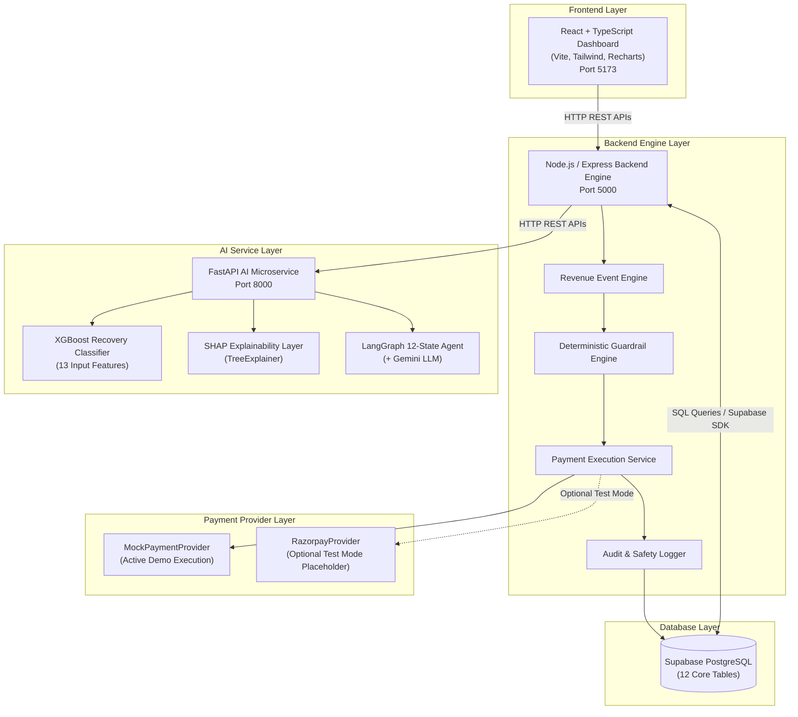

# RazorRecover Architecture & System Design

## 1. Overview

RazorRecover is an AI-powered revenue recovery system designed to diagnose, predict, decide, guard, and execute recovery actions for failed subscription payments.

The architecture is built around a microservices pattern comprising a React single-page frontend, a Node.js/Express backend engine, a Python FastAPI AI microservice, and Supabase PostgreSQL as the persistent database layer.

---

## 2. Monorepo & System Architecture Diagram



---

## 3. Core Component Responsibilities

### 3.1 Frontend Layer (React + TypeScript)
- **Host**: Vite dev server on `http://localhost:5173`.
- **Technologies**: React 18, TypeScript, Tailwind CSS, Recharts, Lucide React icons.
- **Responsibilities**:
  - Displays real-time financial KPIs (Revenue at Risk, Recovered Revenue, Recovery Rate %, Active Cases).
  - Renders time-series revenue trends via Recharts AreaChart.
  - Interactive Case Management (`/dashboard/cases` and `/dashboard/cases/:caseId`) displaying case status, XGBoost predictions, SHAP feature attributions, and attempt timelines.
  - Dedicated Audit Explorer page (`/dashboard/audit`) and Recovery Analytics page (`/dashboard/analytics`).
  - Model Evaluation page (`/dashboard/model-evaluation`) showing verified XGBoost metrics vs operational business recovery metrics.
  - "Run Recovery Demo" hero trigger for instant execution of the ₹12,500 demo flow.

### 3.2 Backend Engine Layer (Node.js + Express)
- **Host**: Express HTTP server on `http://localhost:5000`.
- **Responsibilities**:
  - **Revenue Event Engine**: Ingests billing events (`PAYMENT_FAILED`, `PAYMENT_SUCCESS`, `CHECKOUT_ABANDONED`, `SUBSCRIPTION_FAILED`, `INVOICE_OVERDUE`), calculates revenue-at-risk, and manages recovery cases.
  - **Payment Execution Service**: Authoritative single source of truth for payment retries, webhook processing, idempotency checks, and database updates.
  - **Deterministic Policy Guardrails**: Enforces hard boundaries (maximum retries, high-value thresholds, customer opt-outs, already-recovered checks).
  - **Middleware**: Applies rate limiting (`rateLimiter.js`), strict UUID/enum input validation, and safe error handling (`errorHandler.js`).
  - **Audit Logger**: Appends immutable records to `audit_logs` for every action and state transition.

### 3.3 Database Layer (Supabase PostgreSQL)
- **Host**: Cloud Supabase PostgreSQL instance.
- **Responsibilities**:
  - Stores relational domain objects across 12 normalized tables (`customers`, `subscriptions`, `invoices`, `payments`, `revenue_events`, `recovery_cases`, `recovery_attempts`, `ai_predictions`, `ai_decisions`, `recovery_explanations`, `audit_logs`, `notifications`).
  - Enforces database check constraints (e.g. non-negative payment amounts and revenue at risk) and performance indexes.

### 3.4 AI Service Layer (Python + FastAPI)
- **Host**: Uvicorn HTTP server on `http://localhost:8000`.
- **Responsibilities**:
  - **XGBoost Recovery Classifier**: Evaluates 13 customer and payment features to output recovery probability ($P_{recovery} \in [0.0, 1.0]$) and risk level.
  - **SHAP Explainability Engine**: Computes local TreeExplainer feature attributions and generates human-readable narrative explanations.
  - **LangGraph 12-State Agent**: Stateful decision graph orchestrating diagnosis via Google Gemini LLM (or heuristic fallback) and recommending structured recovery interventions.

### 3.5 Payment Provider Abstraction Layer
- **Interface**: `PaymentProvider` abstract base class defining `executePayment()`, `verifyPayment()`, and `handleWebhook()`.
- **`MockPaymentProvider`**: Active default provider generating deterministic simulated outcomes (`SUCCESS`, `FAILED`, `PENDING`, `CANCELLED`) with reference IDs (`MOCK_PAY_XXXXXXXX`). Requires zero API credentials.
- **`RazorpayProvider`**: Optional test-mode placeholder for Razorpay Test Mode integration. Zero production credentials required for demo.

---

## 4. Service Communication & Data Flow

```
[Customer Payment Failure]
          │
          ▼
1. POST /api/events (Backend)
          │  ───> Ingest event & create recovery_case (Status: open)
          │
2. POST /agent/run-workflow (AI Service)
          │  ───> XGBoost predicts P_recovery
          │  ───> SHAP computes feature attributions
          │  ───> Gemini LLM / Heuristic generates diagnosis & intervention
          │
3. Apply Policy Guardrails (Backend Engine)
          │  ───> Verify max retries, amount threshold, opt-out status
          │
4. Execute Action via MockPaymentProvider (Backend Engine)
          │  ───> Simulated settlement (MOCK_PAY_SUCCESS)
          │
5. Persist DB Updates & Audit Log (Supabase)
          │  ───> Update case status to 'recovered', amount to ₹12,500
          │
6. Refresh Dashboard UI (Frontend)
             ───> Live KPI summary & activity feed updated
```

---

## 5. Network Ports & Protocols

| Service | Protocol | Host | Port | Environment |
| :--- | :--- | :--- | :--- | :--- |
| React Frontend | HTTP | `localhost` | `5173` | Browser Client |
| Express Backend | HTTP / REST | `localhost` | `5000` | Node.js Runtime |
| FastAPI AI Service | HTTP / REST | `localhost` | `8000` | Python 3.10+ |
| Supabase PostgreSQL | HTTPS / WebSockets | Cloud / Remote | `5432` / `443` | Managed PostgreSQL |
